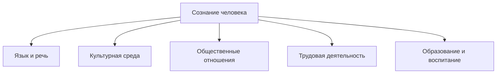
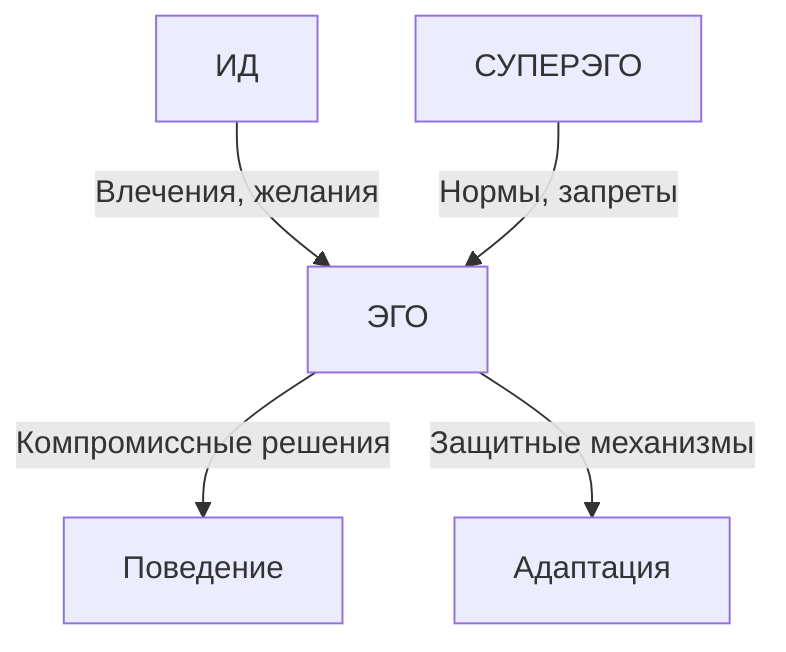

# Конспект: Тема 5 - Сознание человека, его характеристики

## 📋 Содержание
1. [Определение и сущность сознания](#определение-и-сущность-сознания)
2. [Социальный характер сознания](#социальный-характер-сознания)
3. [Интенциональность сознания](#интенциональность-сознания)
4. [Свобода сознания](#свобода-сознания)
5. [Рефлексия](#рефлексия)
6. [Структура психики](#структура-психики)
7. [Сознательное и бессознательное](#сознательное-и-бессознательное)
8. [Контрольные вопросы](#контрольные-вопросы)

---

## 🧠 Определение и сущность сознания

**Сознание** — высшая форма отражения действительности, свойственная человеку, представляющая собой совокупность психических процессов, позволяющих ему ориентироваться в окружающем мире, времени, собственной личности.

### 🔑 Ключевые характеристики сознания:

| Характеристика | Описание | Проявление |
|----------------|----------|------------|
| **Отражательная способность** | Способность воспроизводить действительность в психических образах | Восприятие, мышление, память |
| **Целеполагание** | Способность ставить цели и планировать действия | Планирование, проектирование |
| **Творческая активность** | Способность создавать новое | Искусство, наука, изобретения |
| **Самосознание** | Осознание себя как субъекта | Самопознание, самооценка |

---

## 👥 Социальный характер сознания

### 🏛️ Основные аспекты социальности сознания:

**Сознание формируется в процессе социализации** и имеет общественную природу.

#### 📊 Факторы социального формирования сознания:



### 🗣️ Роль языка в формировании сознания:

| Функция языка | Влияние на сознание | Пример |
|---------------|---------------------|---------|
| **Коммуникативная** | Обмен информацией между людьми | Диалог, дискуссия |
| **Когнитивная** | Структурирование мышления | Понятия, категории |
| **Культурная** | Передача культурного опыта | Фольклор, литература |
| **Регулятивная** | Управление поведением | Нормы, правила |

### 🌍 Культурно-исторические особенности:
- **Менталитет народа** — специфика мышления и мировосприятия
- **Национальные традиции** — устоявшиеся формы сознания
- **Эпоха** — дух времени, определяющий характер сознания

---

## 🎯 Интенциональность сознания

**Интенциональность** — направленность сознания на объект, его предметность.

### 🔍 Основные характеристики:

#### "Сознание всегда есть сознание о чем-то"

**Структура интенционального акта**:
1. **Субъект** — тот, кто осознает
2. **Акт сознания** — процесс осознания
3. **Объект** — то, что осознается

### 📋 Виды интенциональных актов:

| Тип акта | Характеристика | Пример |
|----------|----------------|---------|
| **Восприятие** | Чувственное освоение объекта | Видение красоты заката |
| **Воспоминание** | Обращение к прошлому опыту | Воспоминание о детстве |
| **Воображение** | Создание новых образов | Фантазии о будущем |
| **Мышление** | Логическое постижение | Решение математической задачи |
| **Эмоция** | Оценочное отношение | Радость от встречи |

### 🎭 Интенциональность и смысл:
- Сознание не просто отражает, но **придает смысл**
- Один объект может иметь **разные смыслы** для разных людей
- Смысл зависит от **контекста** и **личного опыта**

---

## 🕊️ Свобода сознания

**Свобода сознания** — способность человека делать осознанный выбор, не быть полностью детерминированным внешними обстоятельствами.

### ⚖️ Диалектика свободы и необходимости:

| Аспект | Свобода | Необходимость |
|--------|---------|---------------|
| **Определение** | Возможность выбора | Объективная обусловленность |
| **Проявление** | Творчество, инициатива | Законы природы и общества |
| **Ограничения** | Познание необходимости | Незнание законов |

### 🎪 Формы проявления свободы сознания:

#### 1. 🎨 **Творческая свобода**
- Способность создавать новое
- Преодоление шаблонов и стереотипов
- Художественное и научное творчество

#### 2. 🤔 **Мыслительная свобода**
- Критическое мышление
- Способность к сомнению
- Независимость суждений

#### 3. ⚖️ **Моральная свобода**
- Выбор между добром и злом
- Ответственность за поступки
- Следование совести

#### 4. 🗳️ **Социально-политическая свобода**
- Участие в общественной жизни
- Выражение своих взглядов
- Влияние на социальные процессы

### 🔄 Формула свободы:
**Свобода = Познанная необходимость + Возможность выбора**

---

## 🪞 Рефлексия

**Рефлексия** — способность сознания обращаться к самому себе, осмысливать собственные состояния, процессы и содержания.

### 🔍 Виды рефлексии:

#### 1. 🧠 **Познавательная рефлексия**
- Осмысление процесса познания
- Анализ своих знаний и убеждений
- Методологическое самосознание

#### 2. 💭 **Личностная рефлексия**
- Самопознание и самоанализ
- Осознание своих качеств и особенностей
- Работа над собой

#### 3. 🤝 **Социальная рефлексия**
- Осмысление своего места в обществе
- Анализ межличностных отношений
- Понимание социальных ролей

#### 4. 🎭 **Экзистенциальная рефлексия**
- Размышления о смысле жизни
- Осознание конечности существования
- Поиск жизненных ценностей

### 📊 Структура рефлексивного процесса:

```
Опыт → Остановка → Анализ → Синтез → Новое понимание → Планирование
  ↑                                                           ↓
  ←─────────────────── Обратная связь ──────────────────────────
```

### 🎯 Функции рефлексии:

| Функция | Описание | Результат |
|---------|----------|-----------|
| **Саморегуляция** | Контроль над своими действиями | Целенаправленное поведение |
| **Самопознание** | Понимание себя | Адекватная самооценка |
| **Развитие** | Осмысление опыта | Личностный рост |
| **Творчество** | Генерация новых идей | Инновации и открытия |

---

## 🏗️ Структура психики

### 🧩 Общая структура психики человека:

#### 1. 🌟 **Сознательное**
- То, что осознается в данный момент
- Предмет актуального внимания
- Ясные, отчетливые переживания

#### 2. 🌫️ **Предсознательное**
- То, что может быть легко осознано
- Воспоминания, знания "на периферии"
- Переходная зона между сознанием и бессознательным

#### 3. 🌑 **Бессознательное**
- То, что не осознается
- Вытесненные переживания
- Инстинкты и архетипы

### 📊 Соотношение уровней психики:

```
      Сознательное (10%)
    ═══════════════════════
   Предсознательное (20%)
  ═══════════════════════════
 Бессознательное (70%)
```

---

## 🌊 Сознательное и бессознательное

### 🧠 Теория З. Фрейда

**Зигмунд Фрейд** (1856-1939) — основатель психоанализа, создатель структурной модели психики.

#### 🏛️ Структурная модель психики по Фрейду:

| Инстанция | Принцип | Функция | Характеристика |
|-----------|---------|---------|----------------|
| **Ид (Оно)** | Принцип удовольствия | Источник влечений | Бессознательное, иррациональное |
| **Эго (Я)** | Принцип реальности | Адаптация к реальности | Сознательное, рациональное |
| **Суперэго (Сверх-Я)** | Принцип долженствования | Моральный контроль | Надсознательное, нормативное |

### ⚔️ Динамика взаимодействия:



### 🛡️ Защитные механизмы психики:

| Механизм | Описание | Пример |
|----------|----------|---------|
| **Вытеснение** | Исключение из сознания неприятных воспоминаний | Забывание травматических событий |
| **Проекция** | Приписывание другим своих качеств | "Все люди эгоистичны" |
| **Рационализация** | Логическое оправдание иррациональных поступков | Оправдание своих неудач |
| **Сублимация** | Переключение энергии на социально приемлемые цели | Творчество как выход агрессии |

### 🎭 Роль бессознательного:

#### 🌙 **Положительные аспекты:**
- Источник творческой интуиции
- Хранилище культурного опыта
- Основа эмоциональной жизни

#### ⚠️ **Проблематичные аспекты:**
- Источник неврозов и конфликтов
- Иррациональные страхи и фобии
- Неконтролируемые влечения

### 🔄 Процесс осознания бессознательного:

**Цель психоанализа**: "Где было Ид, должно стать Эго"

**Методы**:
- Свободные ассоциации
- Анализ сновидений
- Интерпретация оговорок
- Перенос в терапевтических отношениях

---

## 🎯 Контрольные вопросы

### 📝 Вопросы для самопроверки:

1. **Определение**: Что такое сознание и каковы его основные характеристики?

2. **Социальность**: Как социальная среда влияет на формирование сознания?

3. **Интенциональность**: Что означает "направленность" сознания на объект?

4. **Свобода**: В чем проявляется свобода человеческого сознания и каковы ее границы?

5. **Рефлексия**: Какую роль играет рефлексия в развитии сознания?

6. **Структура**: Опишите структуру психики согласно теории Фрейда.

7. **Бессознательное**: Как бессознательное влияет на сознательную деятельность?

8. **Защитные механизмы**: Приведите примеры работы защитных механизмов психики.

9. **Язык**: Какова роль языка в формировании и функционировании сознания?

10. **Творчество**: Как связаны сознание и творческая деятельность человека?

### 🔍 Задания для углубленного изучения:

1. **Анализ интенциональности**: Проанализируйте свой день с точки зрения интенциональных актов сознания.

2. **Рефлексивный дневник**: Ведите в течение недели записи своих рефлексий о прожитом дне.

3. **Исследование бессознательного**: Проанализируйте свои сновидения или оговорки с точки зрения теории Фрейда.

4. **Социокультурный анализ**: Сравните особенности сознания людей разных культур и эпох.

### 🧪 Практические упражнения:

#### 1. 🎯 **Упражнение на осознанность**
Попробуйте в течение 10 минут полностью сосредоточиться на настоящем моменте, отмечая все, что происходит в вашем сознании.

#### 2. 🪞 **Рефлексивное письмо**
Напишите эссе на тему "Что я знаю о своем сознании?" (объем 1-2 страницы).

#### 3. 🎭 **Анализ защитных механизмов**
Понаблюдайте за собой и окружающими, попытайтесь выявить проявления различных защитных механизмов.

---

## 📚 Рекомендуемая литература

### 📖 Основная литература:
1. Фрейд З. Толкование сновидений
2. Юнг К.Г. Структура психики и процесс индивидуации
3. Гуссерль Э. Идеи к чистой феноменологии
4. Выготский Л.С. Мышление и речь

### 📚 Дополнительная литература:
1. Леонтьев А.Н. Деятельность. Сознание. Личность
2. Мамардашвили М.К. Сознание как философская проблема
3. Чалмерс Д. Сознающий ум
4. Деннет Д. Виды психики

### 🎬 Рекомендуемые фильмы для иллюстрации:
- "Начало" (Inception) — уровни сознания
- "Мементо" — память и сознание
- "Матрица" — природа реальности и сознания

---

## 🔬 Современные исследования сознания

### 🧠 Нейронаука сознания:
- Исследования нейронных коррелятов сознания
- Проблема "трудной задачи" сознания (Д. Чалмерс)
- Теории интегрированной информации

### 🤖 Искусственный интеллект:
- Может ли машина обладать сознанием?
- Тест Тьюринга и его ограничения
- Проблема квалиа и субъективного опыта

---

*📅 Дата создания конспекта: [текущая дата]*
*🎓 Курс: Философия*
*📖 Тема 5: Сознание человека, его характеристики*
