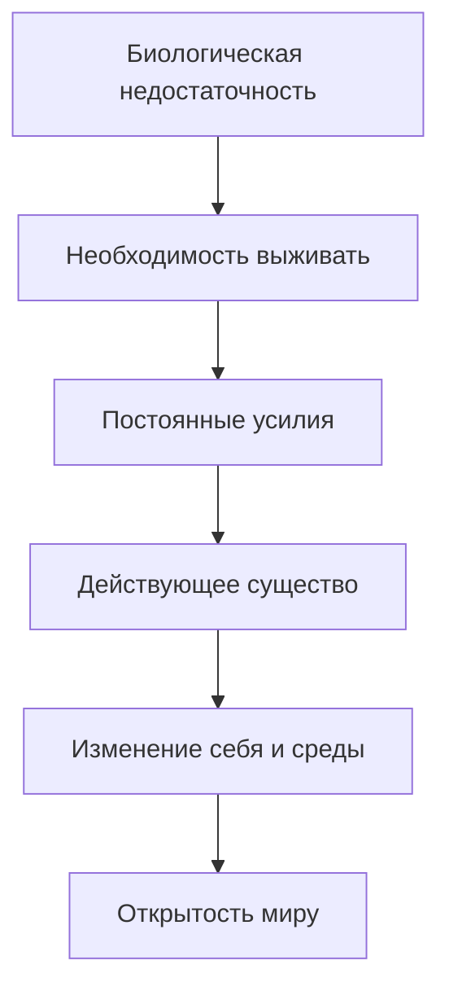
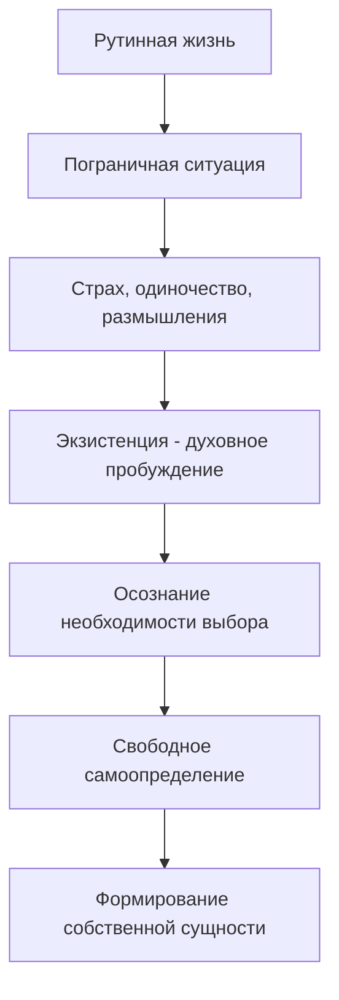
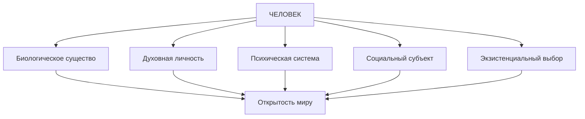

# Конспект: Тема 6 - Философская антропология

## 📋 Содержание
1. [Определение и предмет философской антропологии](#определение-и-предмет-философской-антропологии)
2. [Немецкая философская антропология XX века](#немецкая-философская-антропология-xx-века)
3. [Марксистская теория человека](#марксистская-теория-человека)
4. [Психоаналитическая теория Фрейда](#психоаналитическая-теория-фрейда)
5. [Экзистенциалистская концепция человека](#экзистенциалистская-концепция-человека)
6. [Сравнительный анализ концепций](#сравнительный-анализ-концепций)
7. [Контрольные вопросы](#контрольные-вопросы)

---

## 🎯 Определение и предмет философской антропологии

**Философская антропология** (греч. anthropos + logos) — философское учение о человеке, изучающее его в полноте бытия.

### 🔍 Основные проблемы философской антропологии:

| Проблема | Описание | Ключевые вопросы |
|----------|----------|------------------|
| **Антропогенез** | Происхождение человека | Как появился человек? Что отличает его от животных? |
| **Природа и сущность человека** | Фундаментальные характеристики | Что такое человек? В чем его специфика? |
| **Смысл жизни и предназначение** | Цель человеческого существования | Зачем живет человек? Какова его миссия? |

### 📅 Историческая справка:

**1928 год** — немецкий философ **Макс Шелер** в работе «Положение человека в космосе» обосновал необходимость создания специальной науки для изучения человека в полноте его бытия, а не с ограниченной точки зрения отдельных наук.

---

## 🇩🇪 Немецкая философская антропология XX века

### 👨‍🎓 1. Концепция Макса Шелера (1874-1928)

#### 🔑 Ключевая идея: **Человек = Животное + Дух**

**Основные положения:**
- "Человек — есть животное. Он не развился из животного царства, а был, есть и всегда останется животным"
- **НО!** Отличие человека — наличие **духа**
- Дух дает человеку **свободу**, **индивидуальность** и **личностность**

#### 🌟 Характеристики духа:

| Характеристика | Описание | Проявление |
|----------------|----------|------------|
| **Свобода** | Способность к выбору | Принятие решений |
| **Индивидуальность** | Уникальность личности | Неповторимые черты |
| **Личностность** | Самосознание и ответственность | Моральные качества |

---

### 👨‍🔬 2. Теория Арнольда Гелена (1904-1976)

#### 🔑 Ключевая идея: **"Человек — открытое существо"**

**Основа теории — изначальная недостаточность человека:**

#### ❌ Биологические "недостатки" человека:
- Отсутствие волосяного покрова
- Слабые зубы и когти
- Неострые органы чувств
- Физическая неприспособленность

#### ✅ Преимущества "недостаточности":



**Вывод:** Недостаточность заставляет человека **действовать**, **изменяться** и **изменять мир** — в этом его **открытость**.

---

### 👨‍💼 3. Концепция Гельмута Плесснера (1892-1985)

#### 🔑 Ключевая идея: **Эксцентрическая позиция человека**

**Эксцентрическая позиция** — способность человека:
- Отделять себя от природы
- Выделять свое **Я** от окружающего мира
- Смотреть на себя **со стороны**

#### ⚖️ Диалектика эксцентрической позиции:

| Преимущества ✅ | Недостатки ❌ |
|----------------|---------------|
| Свобода самореализации | Потеря равновесия |
| Возможность выбора любого пути | Трудность выбора |
| Самопознание | Экзистенциальная неопределенность |

#### 🏠 "Закон утопического места"
Человек часто не может определить:
- Кто он такой
- Что ему следует делать
- Где его место в мире

---

## 🚩 Марксистская теория человека

### 👨‍🏭 Карл Маркс (1818-1883) — материалистический подход

#### 🔑 Основные тезисы:

> **"Сущность человека не есть абстракт, присущий отдельному индивиду. В своей действительности она есть совокупность всех общественных отношений"**

> **"Бытие определяет сознание"**

### 🏗️ Структура марксистской антропологии:

#### 1. 👥 **Социальная природа человека**
- Человек = **социальное существо**
- Какова социальность — таков и человек
- Необходимость реформирования общества

#### 2. 🔨 **Труд как сущность человека**

**Роль труда в антропогенезе:**


**Ключевые положения о труде:**
- Труд — **производственная деятельность**
- "Как человек трудится — таким он и будет"
- Труд выделяет человека из животного мира
- Преобразованная действительность изменяет человека

#### 3. ⚖️ **Социальная справедливость**
- Необходимость создания справедливых условий труда
- Критика капиталистического строя
- Зависимость человеческих качеств от социальных условий

### 📊 Формула человека по Марксу:
**Человек = Социальные отношения + Трудовая деятельность + Общественное бытие**

---

## 🧠 Психоаналитическая теория Фрейда

### 👨‍⚕️ Зигмунд Фрейд (1856-1939) — основатель психоанализа

#### 🔑 Революционная идея: **Человек — существо во многом бессознательное**

### 🏔️ Структура психики ("Айсберг личности"):

```
                    Сверх-Я (10%)
                ═════════════════════
               Я - ЭГО (20%)
            ═══════════════════════════
          ОНО - ИД (70%)
        Бессознательное
```

#### 🌊 **ОНО (Ид) — Бессознательное**
**Содержание:**
- Врожденные **инстинкты**
- Забытый прошлый опыт
- Неосознаваемые **страхи** и **комплексы**
- Вытесненные переживания

**Характеристики:**
- Самая большая часть психики
- Источник энергии и влечений
- Не подчиняется логике
- Требует немедленного удовлетворения

#### 🤔 **Я (Эго) — Сознание**
**Функции:**
- Разумное начало
- Адаптация к реальности
- Принятие решений
- Посредник между Оно и Сверх-Я

#### ⛪ **Сверх-Я (Супер-Эго) — Мораль**
**Формирование:**
- Не дано от рождения
- Формируется в процессе социализации
- Результат воспитания и культуры

**Содержание:**
- Нормы и правила
- Запреты и ограничения
- Понятия добра и зла
- Совесть и мораль

### ⚔️ Психическая динамика:

| Инстанция | Требование | Принцип |
|-----------|------------|---------|
| **ОНО** | "Хочу немедленно!" | Принцип удовольствия |
| **СВЕРХ-Я** | "Нельзя, это плохо!" | Принцип долженствования |
| **Я** | "Найдем компромисс" | Принцип реальности |

#### 💥 Пример психического конфликта:
**Ситуация:** Вас сильно разозлили

1. **ОНО** требует: Ударить, накричать, выместить злость
2. **СВЕРХ-Я** запрещает: Нельзя, это некультурно, неправильно
3. **Я** ищет компромисс: Сдержаться, но потом оправдать свою реакцию

#### 🏥 **Психические нарушения**
Возникают, когда **Я** перестает улаживать конфликты между **Оно** и **Сверх-Я**.

### 🎯 Вывод Фрейда о природе человека:
- Человек — **преимущественно животное** существо
- Подчиняется **бессознательным инстинктам**
- Мораль — **искусственно формируемая** установка
- Психический **конфликт неизбежен** и неискореним

---

## 🎭 Экзистенциалистская концепция человека

### 📚 Представители экзистенциализма:
- **Сёрен Кьеркегор** (1813-1855) — предтеча направления
- **Карл Ясперс** (1883-1969)
- **Мартин Хайдеггер** (1889-1976)
- **Жан-Поль Сартр** (1905-1980)
- **Альбер Камю** (1913-1960)

### 🎯 Главный объект — **духовный мир человека**

Акцент на **иррациональной сфере**: эмоции, переживания, чувства, поиск смысла жизни.

### 🌟 Центральная категория — **ЭКЗИСТЕНЦИЯ**

#### 🔄 **Экзистенция vs Обычное существование**

| Обычное существование | Экзистенция |
|-----------------------|-------------|
| Рутинное, привычное | Подлинное, осознанное |
| Неосознанное движение | Ясное осознание жизни |
| Следование стереотипам | Индивидуальный выбор |
| "Спячка духа" | "Духовное пробуждение" |

### ⚡ **Пограничная ситуация** — катализатор экзистенции

#### 🔑 Определение:
Значимое (чаще трагическое) событие, которое разрывает круг привычных занятий и очерчивает границу между прошлой жизнью и неизвестным будущем.

#### 📋 Примеры пограничных ситуаций:
- Смерть близкого человека
- Тяжелая болезнь
- Сильное потрясение
- Война и катастрофы
- Крах жизненных планов

### 🔄 Экзистенциальный процесс:



### 🕊️ **Свобода и ответственность**

#### 🔑 Тезис Сартра: **"Существование предшествует сущности"**

**Смысл:** 
- Сущность человека не предзадана
- Мы сами творим свою сущность
- Человек = то, кого сам из себя сделал
- Ответственность полностью на самом человеке

#### ⛓️ **"Человек обречен на свободу"** (Ж.-П. Сартр)

**Парадокс свободы:**
- Любой шаг есть выбор
- Нельзя избежать принятия решений
- Даже отказ от выбора — тоже выбор
- Свобода может быть тяжким бременем

### 😰 **Экзистенциальные переживания:**

| Переживание | Описание | Функция |
|-------------|----------|---------|
| **Страх** | Ужас перед неопределенностью | Пробуждает к жизни |
| **Одиночество** | Осознание уникальности выбора | Формирует индивидуальность |
| **Тоска** | Поиск смысла существования | Мотивирует к самопознанию |
| **Ответственность** | Осознание последствий выбора | Развивает личность |

---

## ⚖️ Сравнительный анализ концепций

### 📊 Сравнительная таблица основных подходов:

| Критерий | Шелер | Гелен | Плесснер | Маркс | Фрейд | Экзистенциализм |
|----------|-------|-------|----------|-------|-------|-----------------|
| **Сущность человека** | Дух + животное | Недостаточность | Эксцентричность | Социальность | Бессознательное | Свобода |
| **Отличие от животных** | Наличие духа | Открытость миру | Рефлексия | Труд | Культура/мораль | Выбор |
| **Источник развития** | Духовность | Необходимость | Самопознание | Трудовая деятельность | Конфликт инстанций | Пограничные ситуации |
| **Проблемы человека** | Конфликт духа/тела | Неприспособленность | Потеря равновесия | Отчуждение | Невроз | Экзистенциальная тревога |
| **Решение проблем** | Развитие духа | Активная деятельность | Самопринятие | Изменение общества | Психоанализ | Аутентичное существование |

### 🎯 **Дополнительность подходов:**

#### 🧩 **Биологический уровень** (Гелен)
Физическая недостаточность → активность

#### 🌟 **Духовный уровень** (Шелер)
Дух → свобода и личность

#### 🧠 **Психологический уровень** (Фрейд)
Бессознательное → поведение

#### 👥 **Социальный уровень** (Маркс)
Общественные отношения → сущность

#### 🎭 **Экзистенциальный уровень** (Экзистенциализм)
Выбор → аутентичность

### 🔄 **Синтетическое понимание человека:**



---

## 🎯 Контрольные вопросы

### 📝 Вопросы для самопроверки:

1. **Определение**: Что изучает философская антропология и каковы ее основные проблемы?

2. **Шелер**: В чем специфика понимания человека Максом Шелером? Что такое "дух"?

3. **Гелен**: Как "недостаточность" человека превращается в его преимущество?

4. **Плесснер**: Что означает "эксцентрическая позиция" и какие она имеет последствия?

5. **Маркс**: Как соотносятся бытие и сознание в марксистской антропологии?

6. **Труд**: Какую роль играет труд в формировании человека по Марксу?

7. **Фрейд**: Опишите структуру психики и взаимодействие ее компонентов.

8. **Экзистенция**: Что такое подлинное существование в экзистенциализме?

9. **Пограничная ситуация**: Приведите примеры и объясните их роль.

10. **Свобода**: Почему экзистенциалисты говорят, что "человек обречен на свободу"?

### 🔍 Задания для углубленного изучения:

#### 1. 🎭 **Анализ собственного опыта**
Вспомните пограничную ситуацию из своей жизни. Проанализируйте ее с точки зрения экзистенциализма: как она изменила ваше самопонимание?

#### 2. 🧠 **Психоаналитическое наблюдение**
В течение дня отмечайте моменты конфликта между "хочу" и "нужно". Как ваше "Я" решает эти конфликты?

#### 3. 🏗️ **Социальный анализ**
Проанализируйте, как различные социальные группы (семья, школа, работа) формируют ваше самопонимание. Подтверждается ли тезис Маркса?

#### 4. 🔍 **Сравнительный анализ**
Выберите конкретную человеческую характеристику (например, творчество) и объясните ее с позиций всех рассмотренных теорий.

### 🎬 **Практические упражнения:**

#### 1. 📝 **Антропологический автопортрет**
Опишите себя с позиций каждой из изученных теорий (1-2 абзаца на каждую).

#### 2. 🎨 **Визуализация концепций**
Создайте схемы или рисунки, иллюстрирующие каждую теорию человека.

#### 3. 🎪 **Ролевая игра**
Представьте дискуссию между всеми изученными философами о природе человека. Какие аргументы приводил бы каждый?

---

## 📚 Рекомендуемая литература

### 📖 Основная литература:
1. **Шелер М.** Положение человека в космосе
2. **Гелен А.** О систематике антропологии
3. **Плесснер Г.** Ступени органического и человек
4. **Маркс К.** Экономическо-философские рукописи 1844 года
5. **Фрейд З.** Психология бессознательного
6. **Сартр Ж.-П.** Экзистенциализм — это гуманизм

### 📚 Дополнительная литература:
1. Гуревич П.С. Философская антропология
2. Марков Б.В. Философская антропология
3. Смирнов И.Н. Человек. Личность. Бытие
4. Проблема человека в западной философии (сборник)

### 🎬 Художественные произведения для иллюстрации:
- **Камю А.** "Посторонний" — экзистенциальная проблематика
- **Кафка Ф.** "Превращение" — отчуждение человека
- **Достоевский Ф.М.** "Записки из подполья" — психология человека

---

## 🌟 Заключение

Философская антропология представляет собой многогранное исследование человека, каждая теория которого освещает определенные аспекты человеческого бытия:

- **Биологический** (недостаточность и открытость)
- **Духовный** (дух и свобода)  
- **Социальный** (общественные отношения и труд)
- **Психологический** (сознательное и бессознательное)
- **Экзистенциальный** (выбор и ответственность)

Только синтез всех подходов дает полноценное понимание сложности и уникальности человеческого существа.

---

*📅 Дата создания конспекта: [текущая дата]*
*🎓 Курс: Философия*
*📖 Тема 6: Философская антропология*
